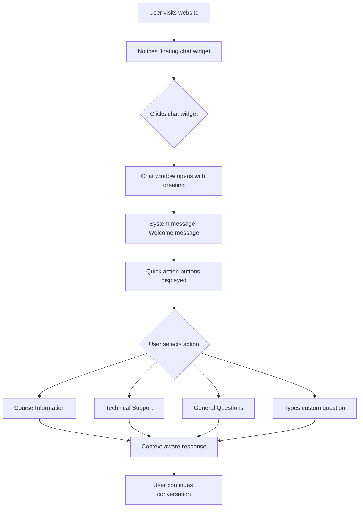
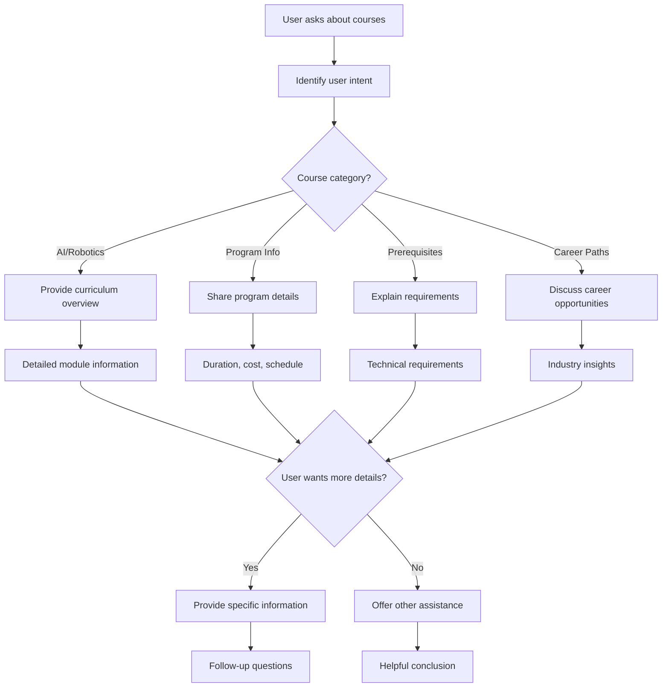
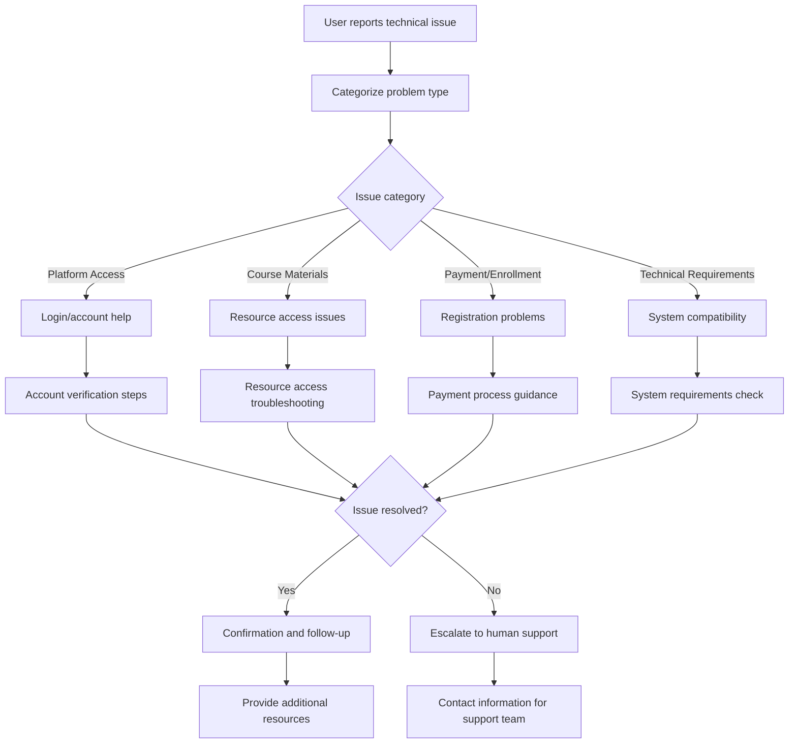
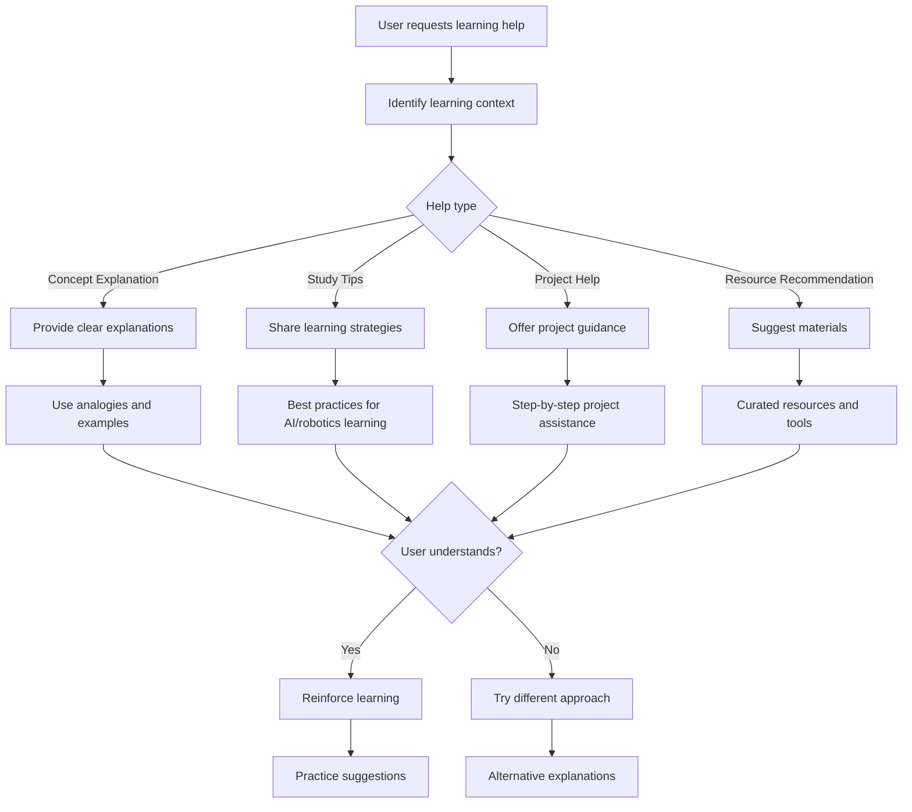
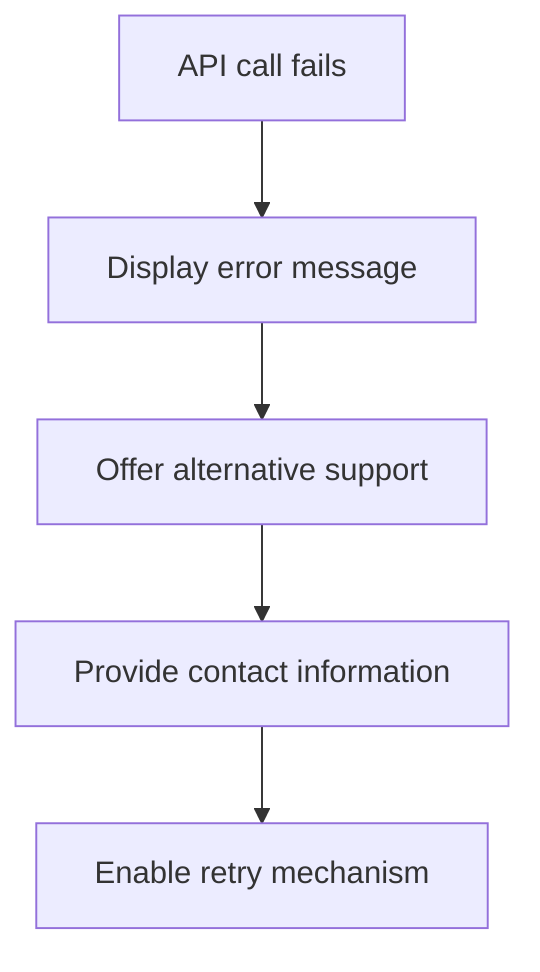
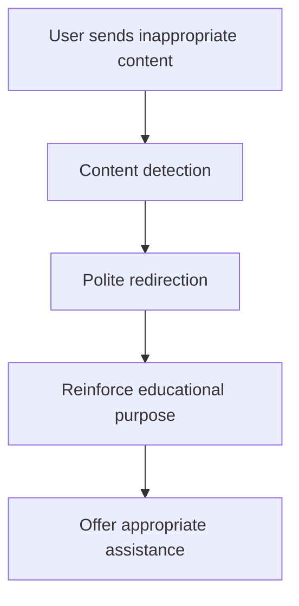
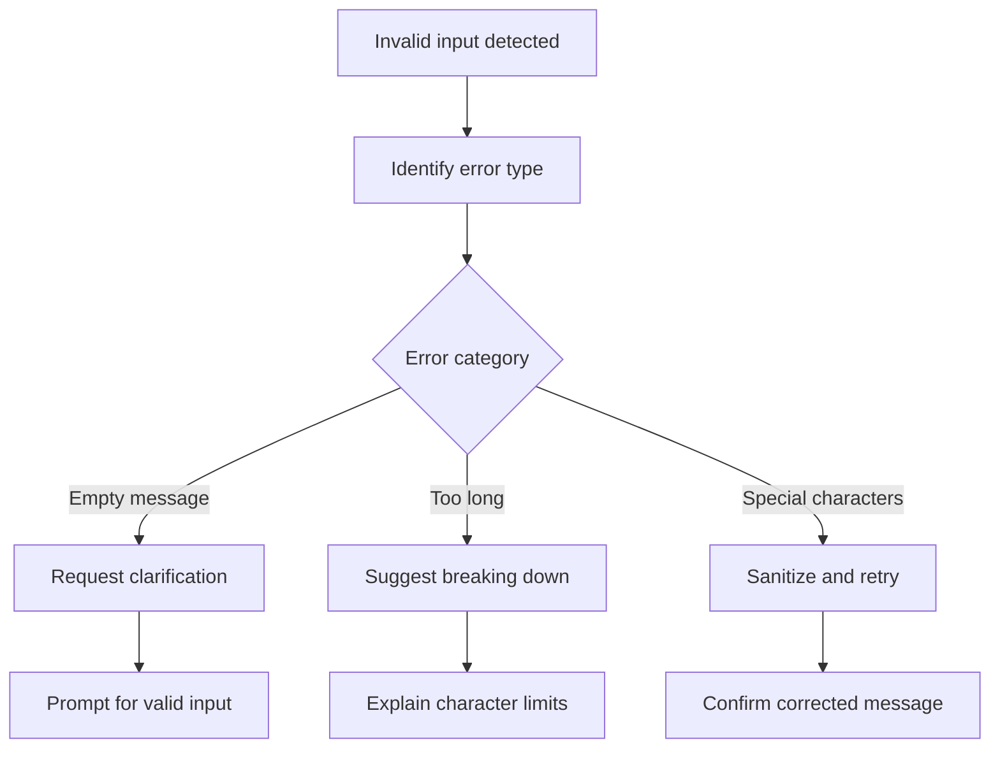

# Chatbot User Flow Documentation

## User Interaction Overview

The Bespoke Academy chatbot supports multiple user interaction patterns, providing assistance across different contexts including student help, course guidance, and technical support.

## Primary User Flows

### 1. First-Time User Interaction



**Greeting Message:**
```
Welcome to Bespoke Academy! I'm your AI learning assistant. I can help you with:
• Course information and recommendations
• Technical support and troubleshooting
• Curriculum guidance and study tips
• Program details and enrollment information

How can I assist you today?
```

### 2. Course Guidance Flow



**Sample Interactions:**
- **User**: "What courses do you offer for beginners?"
- **Bot**: "Our AI Robotics Curriculum is perfect for beginners with no prior experience. The 40-week program covers: Digital Foundations (Weeks 1-8), Electronics & Robotics Basics (Weeks 9-16), AI Concepts & Tools (Weeks 17-28), and Integrated Projects (Weeks 29-40). Would you like details about any specific phase?"

### 3. Technical Support Flow



**Technical Support Templates:**
- **Platform Issues**: Step-by-step login and navigation help
- **Resource Access**: Download links, browser compatibility, cache clearing
- **Account Problems**: Password reset, profile management, enrollment status
- **System Requirements**: Device compatibility, software requirements, internet speed

### 4. Learning Assistance Flow



## Context-Aware Interactions

### Page-Specific Context

#### Homepage Context
- **Focus**: Program overview and first-time visitor information
- **Common Questions**: Academy overview, teaching methodology, enrollment process
- **Actions**: Browse courses, schedule consultation, request information

#### Course Pages Context
- **Focus**: Specific course information and enrollment
- **Common Questions**: Course content, prerequisites, schedule, instructor details
- **Actions**: Enroll now, add to wishlist, download syllabus

#### Contact Page Context
- **Focus**: Support and assistance options
- **Common Questions**: Contact methods, support hours, response times
- **Actions**: Start chat, send email, schedule call

#### About Page Context
- **Focus**: Academy background and credentials
- **Common Questions**: Teaching philosophy, success stories, instructor qualifications
- **Actions**: Meet instructors, view testimonials, learn about methodology

## Conversation States

### 1. Welcome State
- **Trigger**: Chat widget first opened
- **Content**: Greeting message and quick actions
- **User Options**: Select assistance type or type custom question

### 2. Active Conversation State
- **Trigger**: User sends first message
- **Content**: Contextual responses based on user intent
- **Features**: Message history, typing indicators, suggested responses

### 3. Idle State
- **Trigger**: No interaction for 2+ minutes
- **Content**: Gentle prompt to re-engage
- **Options**: Continue conversation, ask new question, close chat

### 4. Resolution State
- **Trigger**: User indicates satisfaction or problem solved
- **Content**: Confirmation and additional help offer
- **Actions**: Rate conversation, start new chat, provide feedback

## Error Handling Flows

### 1. API Unavailable


**Error Message:**
"I'm experiencing technical difficulties right now. For immediate assistance, please:
• Email us at support@bespokeacademy.com
• Call us at (555) 123-4567
• Try again in a few moments

I apologize for the inconvenience!"

### 2. Inappropriate Content


**Response:**
"I'm here to help with educational topics related to our AI and robotics programs. Could you please rephrase your question or let me know how I can assist you with your learning journey?"

### 3. Input Validation Errors


## User Success Metrics

### Engagement Metrics
- **Session Duration**: Average conversation length
- **Message Count**: Typical number of interactions
- **Task Completion**: Rate of successful query resolution
- **User Satisfaction**: Feedback ratings and sentiment

### Usability Metrics
- **Response Time**: Average time to first response
- **Error Rate**: Frequency of technical issues
- **Drop-off Rate**: Users ending conversation prematurely
- **Return Rate**: Users returning for additional help

### Learning Effectiveness
- **Information Accuracy**: Quality of provided information
- **Resource Utilization**: Click-through on recommended resources
- **Conversion Metrics**: Enrollment or contact form completions
- **Knowledge Retention**: User understanding of provided information

## Advanced Features

### 1. Proactive Assistance
- **Context Triggers**: Page-specific help suggestions
- **Time-based Prompts**: Follow-up on incomplete conversations
- **Behavioral Patterns**: Anticipate user needs based on interaction history

### 2. Personalization
- **Learning Style Adaptation**: Adjust response format to user preferences
- **Progress Tracking**: Remember previous conversations and context
- **Customized Recommendations**: Tailor suggestions based on user interests

### 3. Multilingual Support
- **Language Detection**: Identify user's preferred language
- **Translation Services**: Provide responses in multiple languages
- **Cultural Adaptation**: Adjust tone and examples appropriately

## Continuous Improvement

### Feedback Collection
- **Conversation Rating**: Quick satisfaction survey after chat
- **Issue Reporting**: Easy way to report problems or inaccuracies
- **Feature Requests**: Collect suggestions for improvement

### Performance Monitoring
- **Response Quality**: Regular review of chatbot responses
- **User Journey Analysis**: Identify common interaction patterns
- **A/B Testing**: Compare different conversation strategies

---

**Last Updated**: 2025-10-26
**User Flow Version**: 1.0.0